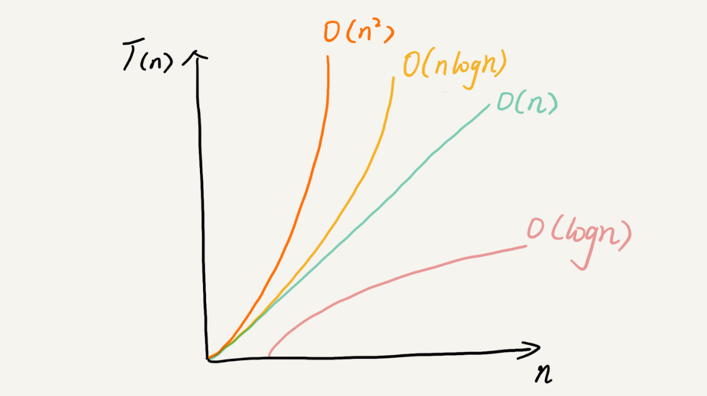

# 算法与数据结构

+ 数据结构是为算法服务的  
+ 算法要作用在特定的数据结构之上


# 数据结构
+ 数组
+ 链表
+ 栈
+ 队列
+ 散列表
+ 二叉树
+ 堆
+ 跳表
+ 图
+ Trie 树

## 算法
+ 递归
+ 排序
+ 二分查找
+ 搜索
+ 哈希算法
+ 贪心算法
+ 分治算法
+ 回溯算法
+ 动态规划
+ 字符串匹配算法

## 复杂度分析

### 事后统计法
+ 测试结果非常依赖测试环境
+ 测试结果受数据规模的影响很大

### 大O复杂度表示法
+ 大O时间复杂度实际上并不具体表示代码真正的执行时间  
+ 而是表示代码执行时间随数据规模增长的变化趋势
```
T(n) = O(f(n))

T(n):代码执行时间
n:数据规模的大小
f(n):每次代码执行的次数总和
O:表示代码的执行时间T(n)与f(n)表达式成正比
```

### 时间复杂度分析
+ 只关注循环执行次数最多的一段代码
+ 加法法则：总复杂度等于量级最大的那段代码的复杂度
+ 乘法法则：嵌套代码的复杂度等于嵌套内外代码复杂度的乘积

### 常见的时间复杂度
+ 常量阶 O(1)
+ 对数阶 O(logn)
+ 线性阶 O(n)
+ 线性对数阶 O(nlogn)
+ 次方阶 O(n^2), O(n^3), O(n^k) 
+ 指数阶 O(2^n)
+ 阶乘阶 O(n!)
+ 注：大O中的logn是指以2为底，n的对数。和数学中10为底不尽相同。(参考《算法导论》)




## 参考学习
+ 极客时间https://time.geekbang.org，《数据结构与算法之美》
+ 《算法导论》
